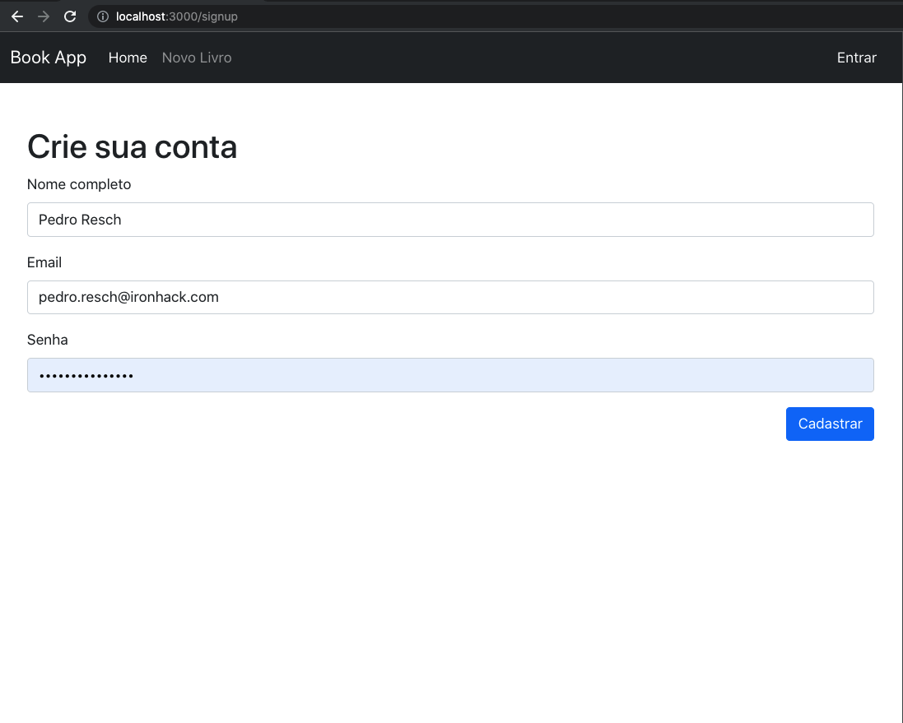
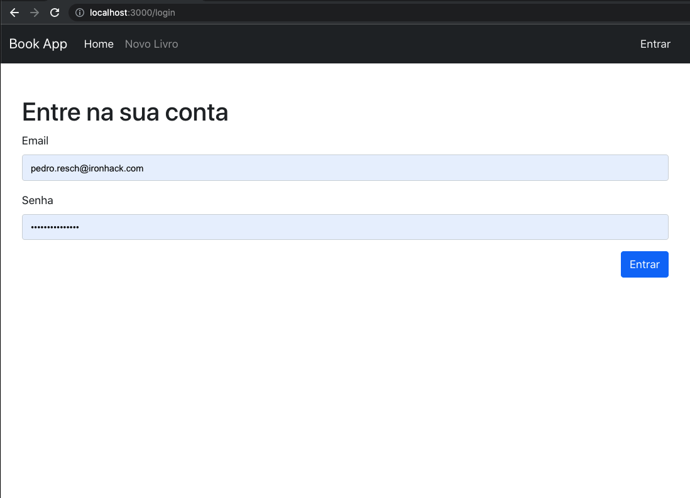
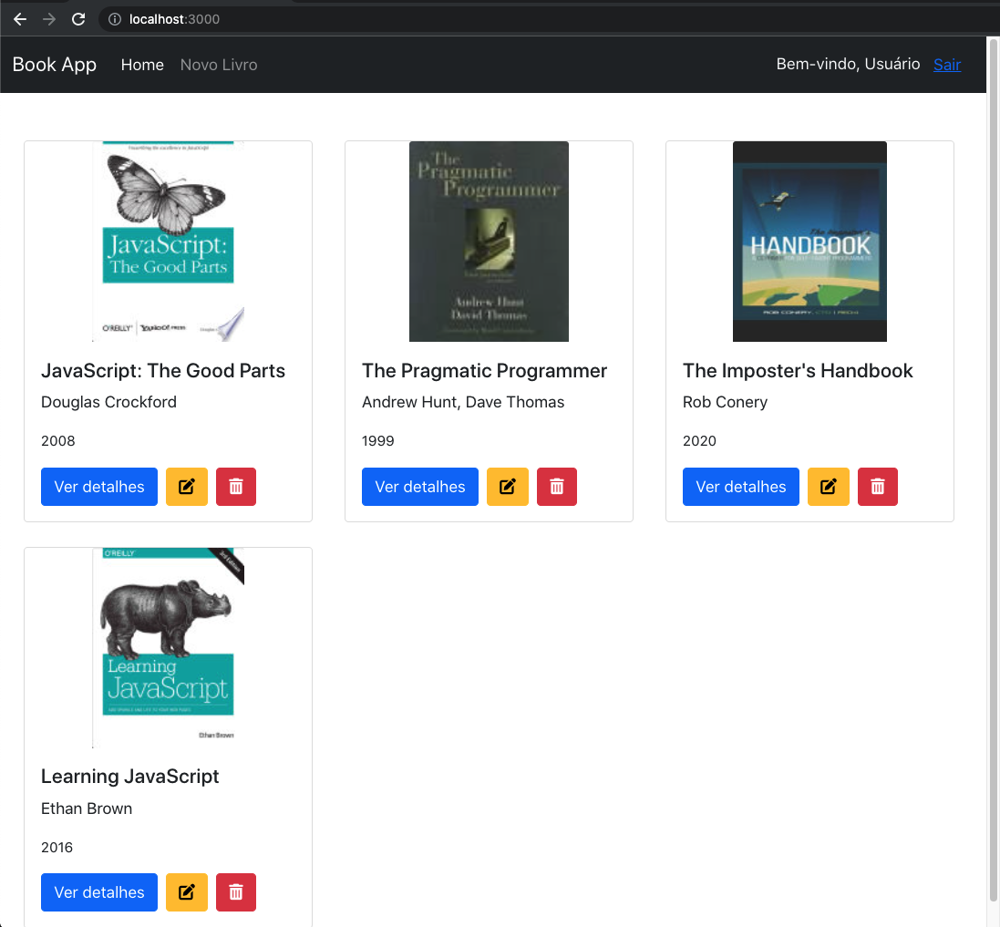
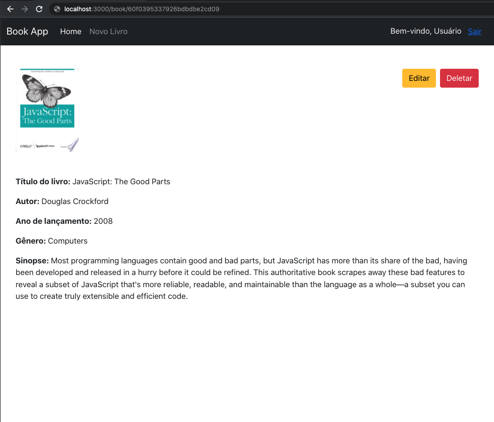
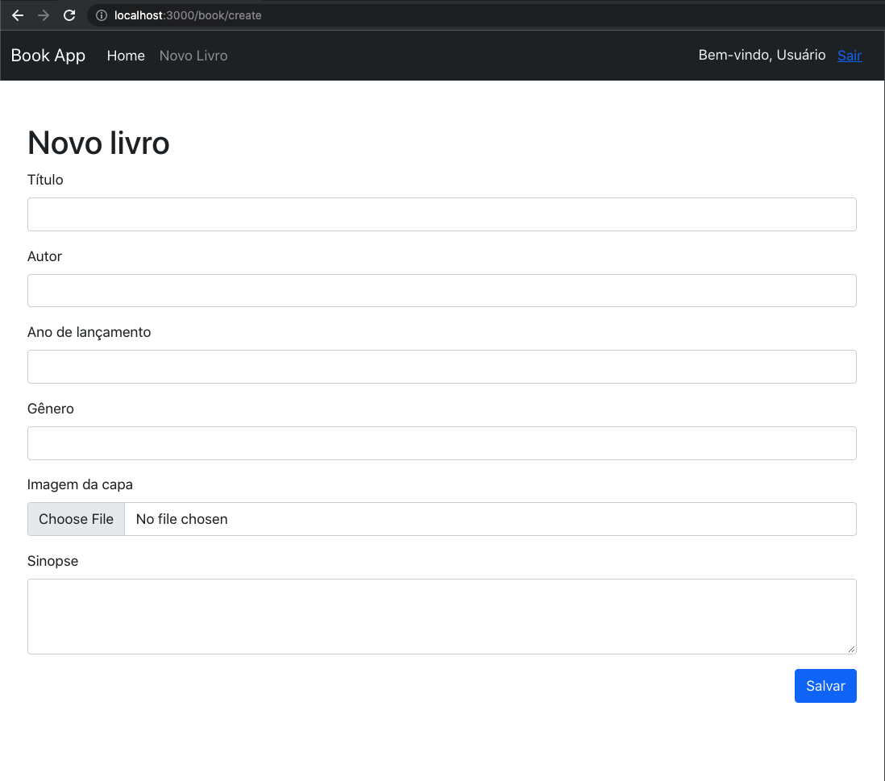
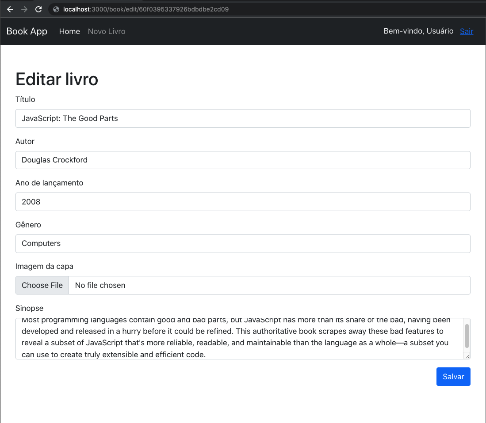

# Escopo Extended Project - Cadastro de Livros

Nesse projeto, o objetivo é praticar novamente o CRUD tanto no backend quanto no frontend. O escopo do projeto será o seguinte:

Você precisará de 2 entidades: `Usuário` e `Livro`. Para esse projeto, você deverá usar os seguintes boilerplates:

- Front: https://github.com/ironhack-sao-wdft/react-ironplate
- Back: https://github.com/ironhack-sao-wdft/ironrest

## Backend

<br />

### Modelos

- 1 arquivo de Modelo para `Usuário` chamado `User.model.js` (vêm pronto no boilerplate)
- 1 arquivo de Modelo para `Livro` chamado `Book.model.js` com os seguintes campos:

<br />

| Nome do campo | Validações                                                                                     |
| ------------- | ---------------------------------------------------------------------------------------------- |
| title         | String, obrigatório                                                                            |
| author        | String, obrigatório                                                                            |
| synopsis      | String                                                                                         |
| releaseYear   | Number, obrigatório                                                                            |
| genre         | String                                                                                         |
| coverImage    | String, default: 'https://www.shortandtweet.com/images/short-and-tweet-default-book-cover.jpg' |

<br />

### Rotas

- 1 arquivo de Rotas para `Usuário` chamado `user.routes.js` (vêm pronto no boilerplate). Não é necessário criar novas rotas nesse arquivo, as rotas prontas já atendem a necessidade do projeto;
- 1 arquivo de Rotas para `Livro` chamado `book.routes.js` com as seguintes rotas:

<br />

| Verbo  | Endpoint  | Valor de retorno                                                     | Protegida? |
| ------ | --------- | -------------------------------------------------------------------- | ---------- |
| POST   | /book     | O objeto de livro criado                                             | Sim        |
| GET    | /book     | Uma array com todos os livros da coleção                             | Não        |
| GET    | /book/:id | Um livro específico, cujo `_id` seja igual ao parâmetro de rota `id` | Não        |
| PATCH  | /book/:id | O objeto de livro atualizado                                         | Sim        |
| DELETE | /book/:id | Um objeto vazio (`{}`)                                               | Sim        |
| POST   | /upload   | A `url` do arquivo armazenado no `Cloudinary`                        | Sim        |

> **Importante:** Os valores de retorno são somente para as requisições que foram bem-sucedidas. Lembre-se que você também precisa responder os erros!

<br />
<br />

### Checklist de tarefas

- Não se esqueça de "ligar" seus arquivos de rota no arquivo principal do projeto (`app.js`)!
- Teste todas as rotas pelo `Insomnia` ou `Postman` antes de iniciar o frontend!
- Não se esqueça de apagar o arquivo `.env` do histórico do Git com o comando de terminal:

```bash
$ git rm -r --cached .env
```

- Lembre de criar todas as variáveis de ambiente (`REACT_APP_URL`, `TOKEN_SIGN_SECRET`, `MONGODB_URI`, etc...)!

<br />
<br />
<br />

# Frontend

No front, você usará o `React` e deverá ter páginas separadas para cada ação do CRUD. Consulte o protótipo de baixa fidelidade para detalhes de como as telas devem ficar.

## Páginas

<br />

Página públicas (sem usar o `<ProtectedRoute />`), ou seja, qualquer usuário pode acessar:

> Obs.: As telas exibidas abaixo são protótipos de baixa fidelidade, portanto seu resultado final não precisa ficar exatamente igual à elas. Estilize como preferir, desde que todos os elementos exibidos abaixo estejam em suas telas.

- 1 página para cadastro de usuário (Signup);
  
- 1 página para login de usuário (Login);
  
- 1 página principal (Home), onde devem ser exibidos todos os livros do banco de dados;
  
- 1 página de detalhe do livro, passando o `_id` do livro via parâmetro de rota. Devem existir `Link`s pra essa página, em cada um dos livros na lista da página anterior (`Home`).
  

Páginas protegidas (usando o `<ProtectedRoute />`), ou seja, somente usuários logados podem acessar:

- 1 página para cadastro de novos livros;
  
- 1 página para edição de livros existentes. Você pode reaproveitar o mesmo componente de formulário que usou no cadastro, porém cadastro e edição devem ser páginas separadas;
  
- 1 página para exclusão de livros existentes. Não é necessário criar um modal (janela popup) de confirmação, mas é um bônus interessante;
- Devem existir `Link`s para as páginas de edição e exclusão em cada um dos livros na lista da página principal (`Home`).

<br />

A responsividade não é obrigatória. Você pode usar qualquer framework de CSS, como o `Bootstrap`, para te auxiliar na estilização.

## Regras de negócio

- A barra de navegação superior (`Navbar`) deve exibir o nome do usuário logado, ou um link para o `Login` caso seja um usuário não-logado;
- Ao criar uma conta, o usuário deve ser redirecionado para o `Login`;
- Ao fazer login, o usuário deve ser redirecionado para a `Home`;
- Ao clicar em `Novo livro` no menu superior, o usuário deve ser redirecionado para a página de cadastro de livros;
- Ao criar um livro, o usuário deve ser redirecionado para a `Home`;
- Ao clicar em "Ver detalhes", o usuário deve ser redirecionado para a página de detalhes daquele livro específico. O `_id` do livro deve ser passado via parâmetro de rota;
- Ao clicar em "Editar", o usuário deve ser redirecionado para a página de edição daquele livro específico. O `_id` do livro deve ser passado via parâmetro de rota;
- Após editar, o usuário deve ser redirecionado para a `Home`;
- Ao clicar em "Deletar", o usuário deve ser redirecionado para a página de deleção daquele livro específico. O `_id` do livro deve ser passado via parâmetro de rota;
- Após deletar, o usuário deve ser redirecionado para a `Home`
- Ao clicar em "Sair", o usuário deve ser deslogado e redirecionado para o `Login`.

Happy coding! 💙
